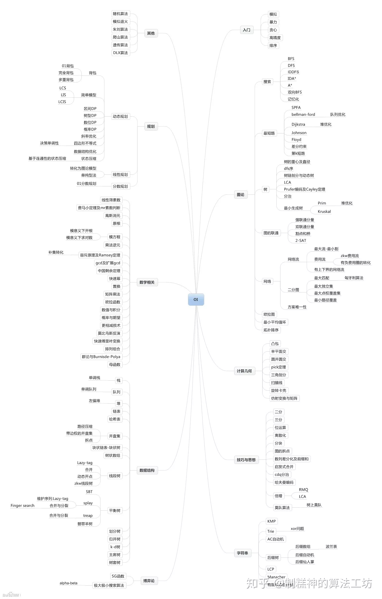

最近对“算法”有了新的理解，对于普通程序员来说，算法功底的好坏对于简洁而高质量的代码至关重要，因此决定从一些经典的ACM算法开始，扎实的学习一下这些算法和编程技巧，以期能有更好的将来。从网上搜索了一些资料，发现“@制糕神的算法工坊”整理的比较全面，这里借用他的一张图片，后续将从他的这个图片开始学习。

<!-- more -->

## 参考文献
1. https://www.zhihu.com/question/332733219/answer/878129865
