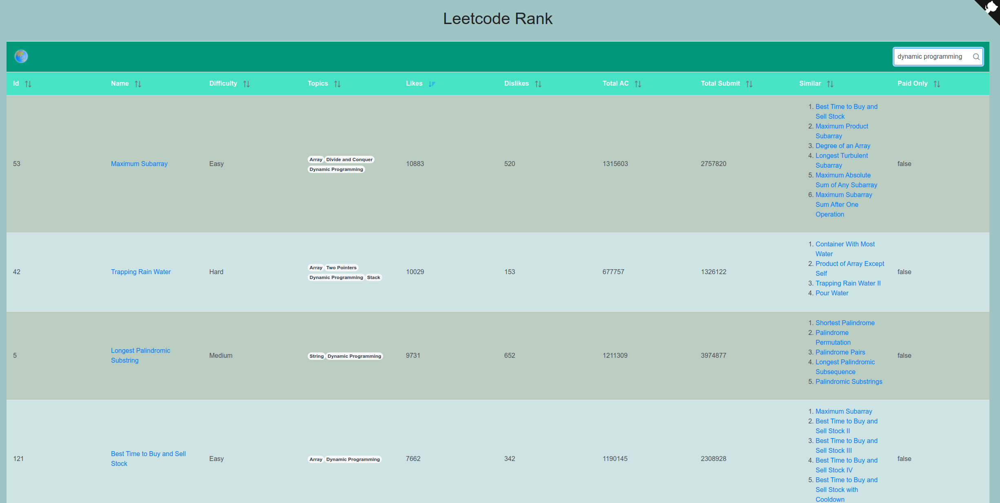

Currently, there are TOO many questions in the leetcode, it is impossible and unnecessary to finish all the questions. Then, how can we select some classic problems?

<!-- more -->

Actually, there are more metrics(i.e., likes number, dislikes number, total ACs, total submits, etc) than that listed on the official main page, we can use them to filter some wanted questions.

To achieve this, I develop a website [leetcode rank](https://leehengtong.com/leetcode_rank/). On this website, all the questions are listed on one page, we can select problems more easily. 

For example, Dynamic program problem with most likes:

    

