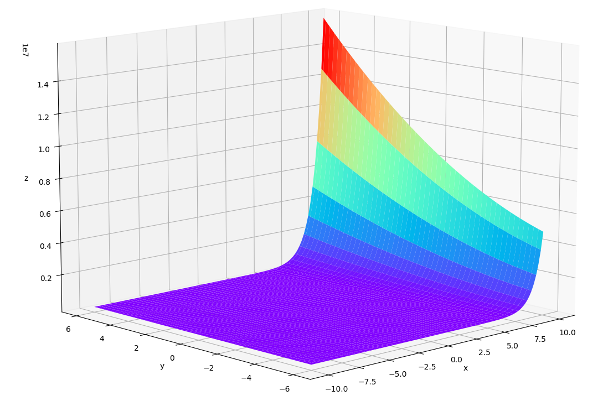
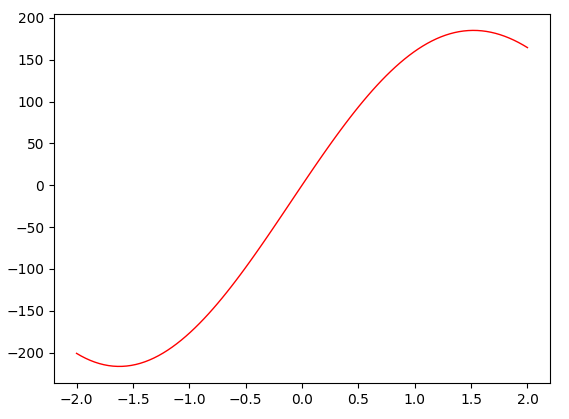

我们工作生活中的很多问题都是优化问题。在本文中，我们给出几个典型的例子，并尝试使用现有的求解器进行求解，作为参照。在后续文章中，我们将介绍一些启发式算法，并对本文中的问题进行求解。

<!-- more -->

## 问题1: 离散空间优化问题
### [luogu P1048 采药](https://www.luogu.com.cn/problem/P1048)
> #### 题目描述
> 辰辰是个天资聪颖的孩子，他的梦想是成为世界上最伟大的医师。为此，他想拜附近最有威望的医师为师。医师为了判断他的资质，给他出了一个难题。医师把他带到一个到处都是草药的山洞里对他说：“孩子，这个山洞里有一些不同的草药，采每一株都需要一些时间，每一株也有它自身的价值。我会给你一段时间，在这段时间里，你可以采到一些草药。如果你是一个聪明的孩子，你应该可以让采到的草药的总价值最大。”
> 
> 如果你是辰辰，你能完成这个任务吗？
> 
> #### 输入格式
> 第一行有 $2$ 个整数 $T$（$1 \le T \le 1000, \ 1 \le T \le 000$）和 $M$（$1 \le M \le 100, \ 1 \le M \le 100$），用一个空格隔开，$T$ 代表总共能够用来采药的时间，$M$ 代表山洞里的草药的数目。
> 
> 接下来的 $M$ 行每行包括两个在 $1$ 到 $100$ 之间（包括 $1$ 和 $100$）的整数，分别表示采摘某株草药的时间和这株草药的价值。
> 
> #### 输出格式
> 输出在规定的时间内可以采到的草药的最大总价值。
> 
> #### 输入样例
> ```
> 70 3
> 71 100
> 69 1
> 1 2
> ```
> 
> #### 输出样例
> ```
> 3
> ```
> #### 说明
> - 对于 30\% 的数据，$M \le 10$
> - 对于全部的数据，$M \le 100$

这是一个典型的0/1背包问题，我们用$x_{i}$表示第$i$种草药采集与否，用$t_{i}$表示采集第$i$种草药所需要的时间，用$m_{i}$表示第$i$种草药的价值，我们的目标是在有限的时间$T$内使采集到的草药价值最大，那么我们就会得到如下的形式化表述:
$$\begin{equation}\label{eq1}
\begin{aligned}
max \ \sum_{i = 1}^{M} x_{i}m_{i} &           \\\\
x_{i}(x_{i}-1) = 0, i \in [1, M]               \\\\
0 \le \sum_{i = 1}^{M}{x_{i}t_{i} \le T}         \\\\
\end{aligned}
\end{equation}$$

上面公式中的$x_{i}(x_{i-1})=0$是为了确保$x_{i}$只能取0和1。针对这个问题，我们使用如下的程序进行求解：
```python
#!/usr/bin/python3

from scipy.optimize import minimize
from scipy.optimize import SR1
from scipy.optimize import NonlinearConstraint
from scipy.optimize import LinearConstraint
import numpy as np

def solve():
    def rosen(x):
        """The Rosenbrock function"""
        m = [100, 1, 2]  # values
        total = 0
        for i in range(len(m)):
            total = x[i] * m[i]

        return -total

    # the constraints
    def cons_f(x):
        return [i * (i - 1) for i in x]

    def cons_J(x):
        return [[2 * x[0] - 1, 0, 0], [0, 2 * x[1] - 1, 0],
                [0, 0, 2 * x[2] - 1]]

    def cons_H(x, v):
        return v[0] * np.array(
            [[2, 0, 0], [0, 0, 0], [0, 0, 0]]) + v[1] * np.array([
                [0, 0, 0], [0, 2, 0], [0, 0, 0]
            ]) + v[2] * np.array([[0, 0, 0], [0, 0, 0], [0, 0, 2]])

    nonlinear_constraint = NonlinearConstraint(cons_f, [0, 0, 0], [0, 0, 0],
                                               jac=cons_J,
                                               hess=cons_H)

    linear_constraint = LinearConstraint([[71, 69, 1]], [0], [70])

    x0 = [1, 0, 0]
    res = minimize(rosen,
                   x0,
                   method='trust-constr',
                   jac="2-point",
                   hess=SR1(),
                   constraints=[nonlinear_constraint, linear_constraint],
                   options={'verbose': 1})
    print(res)


if __name__ == "__main__":
    solve()
```

输出结果：
```
barrier_parameter: 2.048000000000001e-09
barrier_tolerance: 2.048000000000001e-09
         cg_niter: 0
     cg_stop_cond: 1
           constr: [array([-0.0073379 ,  0.00693036,  0.0001018 ]), array([70.00010182])]
      constr_nfev: [106, 0]
      constr_nhev: [82, 0]
      constr_njev: [79, 0]
   constr_penalty: 1.0
 constr_violation: 0.0073378956828978265
   execution_time: 0.149078369140625
              fun: 0.00020358301622653028
             grad: array([ 0., -0., -2.])
              jac: [array([[ 0.98521491,  0.        ,  0.        ],
      [ 0.        , -1.01376596,  0.        ],
      [ 0.        ,  0.        , -1.00020358]]), array([[71, 69,  1]])]
  lagrangian_grad: array([-7.48012763e-15, -1.15411153e-14, -2.22470154e-15])
          message: '`xtol` termination condition is satisfied.'
           method: 'tr_interior_point'
             nfev: 424
             nhev: 0
              nit: 188
            niter: 188
             njev: 106
       optimality: 1.1541115285673698e-14
           status: 2
          success: True
        tr_radius: 1.0000000000000005e-09
                v: [array([-0.01465935,  0.01384519, -1.99938954]), array([0.00020342])]
                x: array([ 9.92607455e-01, -6.88298061e-03, -1.01791508e-04])
```
可以看到使用这个求解器并没有得到正确的结果，上面提到的二值约束对这个求解器不是很友好，求解的结果也不满足约束条件。


## 问题2: 连续空间多变量多约束非线性规划问题
$$min \ f(x) = e^{x_{1}}(4x_{1}^{2}+2x_{2}^{2}+4x_{1}x_{2}+2x_{2}+1)$$

$$\begin{equation}\label{eq2}
\begin{aligned}
1.5 + x_{1}x_{2} -x_{1} - x_{2} &\leq 0          \\\\
-x_{1}x_{2} &\leq 10                           \\\\
-10 \leq x_{1} &\leq 10                       \\\\
-6  \leq x_{2} &\leq 6                        \\\\
\end{aligned}
\end{equation}$$

我们先来看一下函数图像，基本上$x, y$越小，函数的值越小。
<center>
    <a href="images/issue2.png" target="_blank"></a>
</center>
<center>Fig1. 函数图像</center>


我们使用下面的程序对这个问题进行求解：
```python
#!/usr/bin/python3

import math

from scipy.optimize import Bounds
from scipy.optimize import minimize
from scipy.optimize import SR1
from scipy.optimize import NonlinearConstraint

import numpy as np

import matplotlib.pyplot as plt

def plot():
    def f(x, y):
        return np.exp(x) * (4 * x * x + 2 * y * y + 4 * x * y + 2 * y + 1)

    x = np.linspace(-10, 10, 100)
    y = np.linspace(-6, 6, 100)

    X, Y = np.meshgrid(x, y)
    Z = f(X, Y)

    fig = plt.figure()
    ax = plt.axes(projection='3d')
    ax.plot_surface(X, Y, Z, cmap='rainbow')
    ax.set_xlabel('x')
    ax.set_ylabel('y')
    ax.set_zlabel('z')

    plt.show()
    plt.tight_layout()


def solve():
    def rosen(x):
        """The Rosenbrock function"""
        return math.exp(x[0]) * (4 * x[0] * x[0] + 2 * x[1] * x[1] +
                                 4 * x[0] * x[1] + 2 * x[1] + 1)

    # the bound
    bounds = Bounds([-10.0, -6.0], [10.0, 6.0])

    # the constraints
    def cons_f(x):
        return [1.5 + x[0] * x[1] - x[0] - x[1], -x[0] * x[1]]

    def cons_J(x):
        return [[x[1] - 1, x[0] - 1], [-1, -1]]

    def cons_H(x, v):
        return v[0] * np.array([[0, 1], [1, 0]]) + v[1] * np.array([[0, -1],
                                                                    [-1, 0]])

    nonlinear_constraint = NonlinearConstraint(cons_f, [-np.inf, -np.inf],
                                               [0, 10],
                                               jac=cons_J,
                                               hess=cons_H)

    x0 = [0.0, 5.0]
    res = minimize(rosen,
                   x0,
                   method='trust-constr',
                   jac="2-point",
                   hess=SR1(),
                   constraints=[nonlinear_constraint],
                   options={'verbose': 1},
                   bounds=bounds)
    print(res)


if __name__ == "__main__":
    plot()
    solve()
```

输出结果：
```
barrier_parameter: 2.048000000000001e-09
barrier_tolerance: 2.048000000000001e-09
         cg_niter: 529
     cg_stop_cond: 2
           constr: [array([-1.82051237,  9.73411463]), array([-7.68091424,  1.26731198])]
      constr_nfev: [564, 0]
      constr_nhev: [289, 0]
      constr_njev: [288, 0]
   constr_penalty: 1.0
 constr_violation: 0.0
   execution_time: 0.5691990852355957
              fun: 0.0940626469286803
             grad: array([ 0.06804119, -0.01091776])
              jac: [array([[ 0.26731198, -8.68091424],
      [-1.        , -1.        ]]), array([[1., 0.],
      [0., 1.]])]
  lagrangian_grad: array([ 0.00747274, -0.00263313])
          message: '`xtol` termination condition is satisfied.'
           method: 'tr_interior_point'
             nfev: 1692
             nhev: 0
              nit: 536
            niter: 536
             njev: 564
       optimality: 0.007472736269283172
           status: 2
          success: True
        tr_radius: 6.8134308785272305e-09
                v: [array([-0.00751795,  0.05714546]), array([-0.00141336,  0.00016742])]
                x: array([-7.68091424,  1.26731198])
```

初步验证一下，这个结果应该是符合预期的。

## 问题3: 连续空间最值问题
$$\begin{equation}\label{eq3}
\begin{aligned}
max \ f(x) = 200&e^{-0.05x}sin(x)            \\\\
-2 \le &x \le 2
\end{aligned}
\end{equation}$$

我们先来看一下函数图像，这个结果比较明显.
<center>
    <a href="images/issue3.png" target="_blank"></a>
</center>
<center>Fig2. 函数图像</center>


针对这个问题，我们使用如下的程序进行求解：
```python
#!/usr/bin/python3

import math

from scipy.optimize import Bounds
from scipy.optimize import minimize
from scipy.optimize import SR1
import numpy as np

import matplotlib.pyplot as plt


def rosen(x):
    """The Rosenbrock function"""
    return -200 * math.exp(-0.05 * x) * math.sin(x)


def plot():
    x = np.linspace(-2, 2, 100)
    y = [rosen(i) for i in x]

    plt.plot(x, y, color="r", linestyle="-", linewidth=1)
    plt.show()


def solve():
    bounds = Bounds([-2.0], [2.0])
    x0 = [0]

    res = minimize(rosen,
                   x0,
                   method='trust-constr',
                   jac="2-point",
                   hess=SR1(),
                   options={'verbose': 1},
                   bounds=bounds)
    print(res)


if __name__ == "__main__":
    plot()
    solve()
```

输出结果：
```
barrier_parameter: 3.200000000000001e-05
barrier_tolerance: 3.200000000000001e-05
         cg_niter: 9
     cg_stop_cond: 1
           constr: [array([1.52083761])]
      constr_nfev: [0]
      constr_nhev: [0]
      constr_njev: [0]
   constr_penalty: 1.0
 constr_violation: 0.0
   execution_time: 0.08674049377441406
              fun: -185.1242145731396
             grad: array([-5.76906021e-05])
              jac: [<1x1 sparse matrix of type '<class 'numpy.float64'>'
       with 1 stored elements in Compressed Sparse Row format>]
  lagrangian_grad: array([7.09417522e-10])
          message: '`gtol` termination condition is satisfied.'
           method: 'tr_interior_point'
             nfev: 20
             nhev: 0
              nit: 15
            niter: 15
             njev: 10
       optimality: 7.0941752157368e-10
           status: 1
          success: True
        tr_radius: 24107.414128166944
                v: [array([5.76913115e-05])]
                x: array([1.52083761])
```
根据图像得知，这个求解结果是正确的。


## 参考资料
1. https://cloud.tencent.com/developer/article/1099730
2. https://docs.scipy.org/doc/scipy/reference/tutorial/optimize.html
