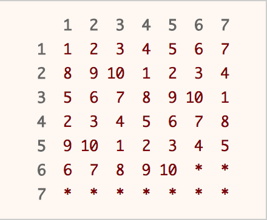

## 问题1: 拒绝采样

### [leetcode 470: Implement Rand10() Using Rand7()](https://leetcode.com/problems/implement-rand10-using-rand7/)

> Given the **API** rand7() that generates a uniform random integer in the range [1, 7], write a function rand10() that generates a uniform random integer in the range [1, 10]. You can only call the API rand7(), and you shouldn't call any other API. Please do not use a language's built-in random API.
>
> Each test case will have one internal argument n, the number of times that your implemented function rand10() will be called while testing. Note that this is not an argument passed to rand10().
>
> Follow up:
> What is the expected value for the number of calls to rand7() function?
> Could you minimize the number of calls to rand7()?
>
> Example 1:
> Input: n = 1
> Output: [2]
>
> Example 2:
> Input: n = 2
> Output: [2,8]
>
> Example 3:
> Input: n = 3
> Output: [3,8,10]
>
> Constraints:
> 1 <= n <= 105

<center>
    <a href="images/table.png" target="_blank"></a>
</center>
<center>Fig 1. 二维随机表格分布</center>

<!-- more -->

我们可以使用“拒绝采样”来求解这个题目。 注意rand10要求返回的数字在[1, 10]之间均匀分布。执行一次rand7()只能得到[1, 7]之间的均匀分布，我们可以执行两次rand7(), 将两次的执行结果看做表格的横纵坐标(row, col)，这时候表格中的每一个单元被选中的机会是相等的, 这样我们就得到了一个二维表格中的均匀分布。接下来， 我们将这个二维坐标转换为一维坐标，我们就得到了[1, 49]之间的均匀分布。我们的最终目标是得到[1, 10]之间的均匀分布，由于可以把[1, n * 10]之间的均匀分布通过取余预算转换为[1, 10]之间的均匀分布，所以这里我们取[1, 40]为有效值，当获取的值不在这个范围时候，我们重新采样。这个过程即拒绝采样。代码如下：
```c++
class Solution {
public:
    int rand10() {
      const int row = rand7();
      const int col = rand7();
      const int idx = (row - 1) * 7 + col;
      if (idx <= 40) {
        return idx % 10 + 1;
      }
      return rand10();
    }
};
```

## 问题2：抽水采样
### [leetcode 398: Random Pick Index](https://leetcode.com/problems/random-pick-index/)
> Given an array of integers with possible duplicates, randomly output the index of a given target number. You can assume that the given target number must exist in the array.
>
> Note:
> The array size can be very large. Solution that uses too much extra space will not pass the judge.
>
> Example:
> ```c
> int[] nums = new int[] {1,2,3,3,3};
> Solution solution = new Solution(nums);
>
> // pick(3) should return either index 2, 3, or 4 randomly.
> // Each index should have equal probability of returning.
> solution.pick(3);
>
> // pick(1) should return 0. Since in the array only nums[0] is equal to 1.
> solution.pick(1);
> ```

我们可以使用“[抽水采样](https://zh.wikipedia.org/wiki/%E6%B0%B4%E5%A1%98%E6%8A%BD%E6%A8%A3)”来求解这个题目。我们先给出代码：

```c++
class Solution {
public:
    Solution(vector<int>& nums): data(nums) {}

    int pick(int target) {
        int res = -1;
        int num = 0;
        for (int i = 0; i < data.size(); ++i) {
            if (data[i] == target) {
                ++num;
                const int r = rand() % num; // value in [0, num - 1]
                if (r == 0) {
                    res = i;
                }
            }
        }

        return res;
    }

    const vector<int>& data;
};
```

下面是一个具体分析：
1. 如果target只出现了1次，那么`rand() % num`等于0，这个index一定会被返回；
2. 如果target出现了2次，第一个index被选中的概率是：`100% * 50% = 50%`；第二个index被选中的概率是`50%`，它们是被均匀采样的；
3. 如果target出现了3次，那么它的3个index被返回的概率分别是：
   - `100% * (1 - 50%) * (1 - 33.33%) = 33.33%`，第一步被选中，第二步和第三步没有被换掉；
   - `50% * (1 - 33.33%) = 33.33%`，第二步被选中，第三步没有被换掉；
   - `33.33%`，第三步被选中；

以此类推，可以保证每个index被选中的概率是相等的。

## 问题3: C++获取随机数
### [rand()](https://en.cppreference.com/w/cpp/numeric/random/rand)
Returns a pseudo-random integral value between 0 and RAND_MAX. And 0 and RAND_MAX included.

### [uniform_int_distribution](https://en.cppreference.com/w/cpp/numeric/random/uniform_int_distribution)
Produces random integer values i, uniformly distributed on the closed interval [a, b].
```c++

#include <random>
#include <iostream>

int main() {
  // Will be used to obtain a seed for the random number engine.
  std::random_device rd;
  // Standard mersenne_twister_engine seeded with rd().
  std::mt19937 gen(rd());
  std::uniform_int_distribution<> distrib(1, 6);

  for (int i = 0; i < 10; ++i) {
    std::cout << distrib(gen) << " ";
  }
  std::cout << std::endl;
}
```
